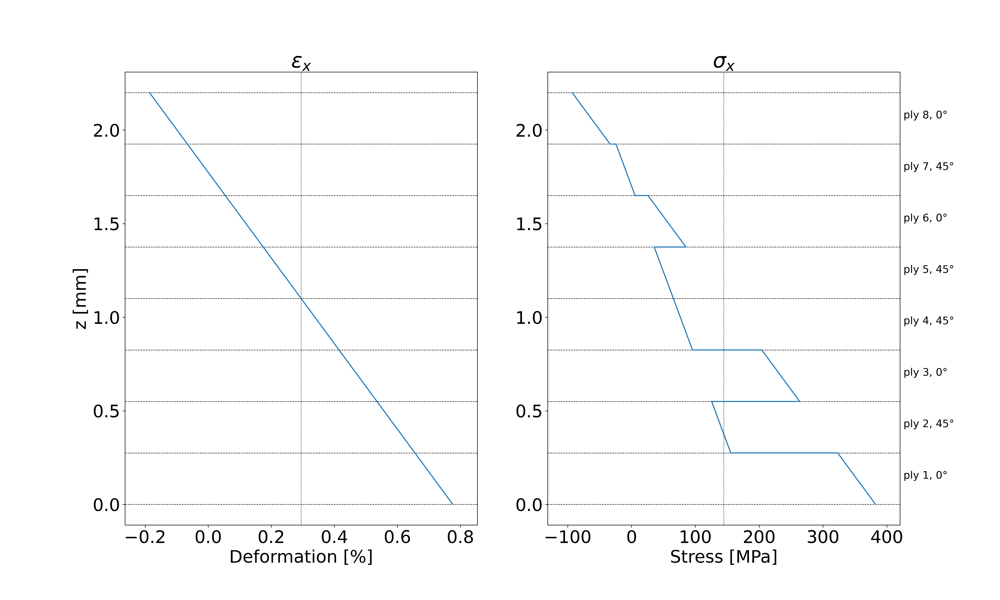

PyComps - easy calculation of composite properties
---------------------------------------------

- calculation of composite stiffness matrix and equivalent stiffness properties
- calculation of composite ply-by-ply stresses and deformation
- FPF verification according to the max stress, max strain and, Tsai-Wu criteria

Package usage: 
-----------------------------------------------------------

Download the package folder, append the link to your "sys" and import PyComp:

.. code-block:: console

    import sys
    sys.path.append(<folder_path>)
    import PyComps as comp

**OR** go to https://pypi.org/project/PyComps/ install the package with the pip install command and easily access the functions with:

.. code-block:: console

    import PyComps as comp

LaminateCalculator.py
---------------------------------------------

**Functions list:**

- calc_equivalent_properties: computes equivalent tensile and flexural orthotropic properties for the object laminate
- print_stifness_matrices: display the stiffness matrices A, B, D, and H 
- print_lam_stifness_matrix: display the full stiffness matrix (A, B, B, D)
- calculate_stress_state: calculate the punctual ply-by-ply stress state from the input of N, M, and V (optional)
- FPF: performs the ply-by-ply strenght analysis from the input of N, M, and V (optional) and plies strength properties (one five-elements - or seven if V is provided - vector for each material involved in the laminte)
- print_margins: to be run after the former function, displays the ply-by-ply margins (at top and bottom ply positions)

**Example_1: lamiante object intialization**
Requested information: 

- ply name 
- ply mechnaical properties
- stackup

.. code-block:: python

    ply_name = 'Epoxy Carbon Woven (230 GPa) Prepreg'
    ply_mech_props = [60, 60, 7, 0.04, 0.3, 0.3, 3.3, 2.7, 2.7, 1450, .275]
    ply_stkup = [0, 45, 0, 45, 45, 0, 45, 0]

    laminate = comp.Laminate([ply_name, ply_mech_props, ply_stkup], mech_prop_units='GPa')

Note: the user can create multi-material laminates simply adding another three-element list after the first (there are no limits to the number three-elements vectors)

.. code-block:: python

    ply_name = 'Epoxy Carbon Woven (230 GPa) Prepreg'
    ply_mech_props = [60, 60, 7, 0.04, 0.3, 0.3, 3.3, 2.7, 2.7, 1450, .275]
    ply_stkup = [0, 45, 0, 45, 45, 0, 45, 0]
    ply_name2 = 'Epoxy Carbon UD (230 GPa) Prepreg'
    ply_mech_props2 = [121, 8.9, 8.9, 0.27, 0.4, 0.27, 4.7, 3.1, 4.7, 1490, .155]
    ply_stkup2 = [0, 45, 90, -45, -45, 90, 45, 0]

    laminate = comp.Laminate([ply_name, ply_mech_props, ply_stkup], [ply_name2, ply_mech_props2, ply_stkup2], mech_prop_units='GPa')

**Example_2: composite equivalent properties calculation**

.. code-block:: python

    ply_name = 'Epoxy Carbon Woven'
    ply_mech_props = [60, 60, 7, 0.04, 0.3, 0.3, 3.3, 2.7, 2.7, 1450, .275]
    ply_stkup = [0, 45, 0, 45, 45, 0, 45, 0]

    laminate = comp.Laminate([ply_name, ply_mech_props, ply_stkup], mech_prop_units='GPa')
    laminate.calc_equivalent_properties(print_cntrl=True, method='Barbero')

As output the code displays the requested properties (print_cntrl=True). Independetly on the print_cntrl values, equivalent properties are stored in object's attributes

**Example_3: calculate ply-by-ply stressess following the FSDT**

.. code-block:: python

    ply_name = 'Epoxy Carbon Woven'
    ply_mech_props = [60, 60, 7, 0.04, 0.3, 0.3, 3.3, 2.7, 2.7, 1450, .275]
    ply_stkup = [0, 45, 0, 45, 45, 0, 45, 0]

    laminate = comp.Laminate([ply_name, ply_mech_props, ply_stkup], mech_prop_units='GPa')
    N = [230, .10, -2.5]
    M = [-160, .012, -0.3]
    V = [.0005, 3.5]
    laminate.calculate_stress_state(N, M, V, print=True, print_shear=True)

If print is set to True also displays the ply by ply stress distribution for the x, y, and xy directions (xz and yz are included if print_shear is True as well).

   

**Example_4: perform a Fist-Ply-Failure verification following Tsai-Wu criteria**

.. code-block:: python

    ply_name = 'Epoxy Carbon Woven'
    ply_mech_props = [60, 60, 7, 0.04, 0.3, 0.3, 3.3, 2.7, 2.7, 1450, .275]
    ply_stkup = [0, 45, 0, 45, 45, 0, 45, 0]

    laminate = comp.Laminate([ply_name, ply_mech_props, ply_stkup], mech_prop_units='GPa')
    N = [230, .10, -2.5]
    M = [-160, .012, -0.3]

    strght = [414, 414 * .5, 414, 414 * .5, 81.41]
    strain = [1/100, .5/100, 1/100, .5/100, 5/100]
    laminate.FPF([strght], N_in=N, M_in=M,  criteria='TsaiWu')

